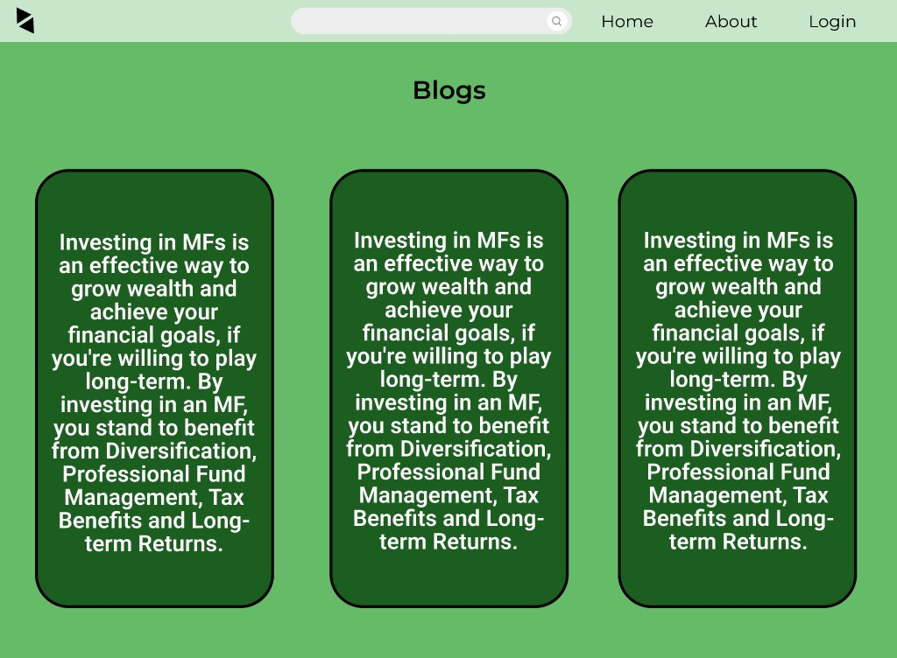

#  Witty Planner
Welcome to Witty Planner, your financial tool designed to suggest investment diversification strategies based on various parameters such as age, income, personal dependents, and investment experience. Our AI-powered model calculates risk appetite using these factors, providing tailored recommendations to optimize your investment portfolio.


## Introduction 
Witty Planner is a project developed for the Witty Hacks Hackathon, aimed at empowering users to make informed investment decisions. By leveraging advanced AI algorithms, Witty Planner analyzes user inputs to generate personalized investment strategies, helping users achieve their financial goals effectively.

</img> 

## Features

- Personalized investment diversification recommendations
- Calculation of risk appetite based on user parameters
- User-friendly interface for easy interaction
- risk assessment 
- analysis
- markets insights and news

</img>


## Prerequisites
Before running Witty Planner, ensure you have the following dependencies installed:

- Node.js and npm for frontend development
- Python for backend development
- MongoDB Atlas account for database management
- Basic knowledge of React.js, Flask, and MongoDB
## Getting Started

Install my-project with npm

To get started with Witty Planner, follow these steps:

Clone the repository to your local machine:

```bash
git clone https://github.com/your-username/witty-planner.git
```
Navigate to the project directory:

```bash
cd kazual
```
Install the required dependencies:

```bash
npm install
```
Run the frontend server:


```bash
npm start
```
Navigate to the backend directory:

```bash

cd backend-flask

``` 
Install backend dependencies:

```bash 
pip install -r requirements.txt
```
Run the backend server:

```bash
python app.py
```
    
## Acknowledgements

We would like to express our gratitude to the organizers of the Witty Hacks Hackathon for providing us with the opportunity to work on this project. Additionally, we acknowledge the contributions of the open-source community and the developers behind the libraries and frameworks used in this project. Thank you for your support and inspiration.


